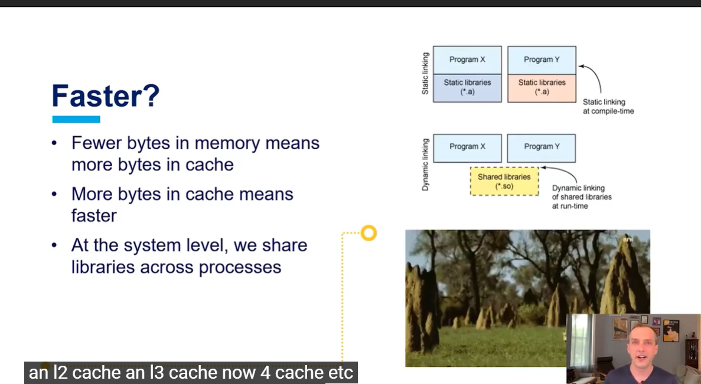
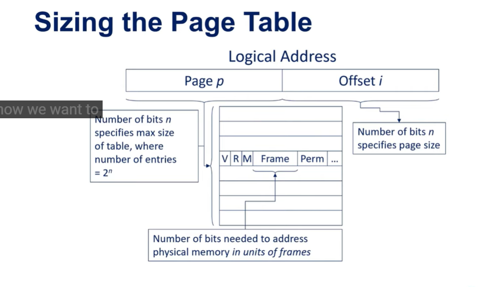
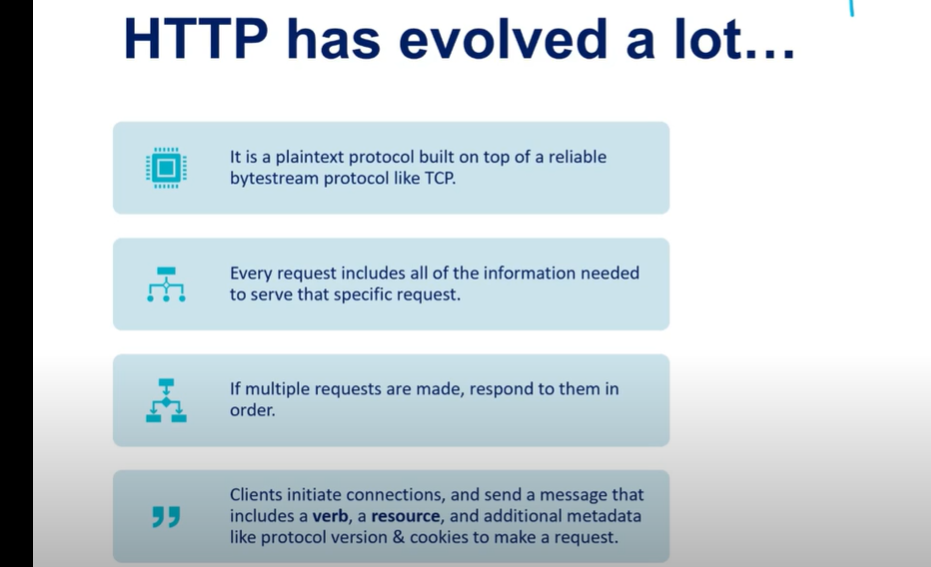

##
****
##  
## At 31:50 you talk about environment variables. However there are some mistakes worth correcting for future viewers. First, although the environment variables are stored in the process' memory, it is stored as zero-terminated strings and not as one big string separated by new-line characters. It is also is not stored on the heap, nor is there a global variable in the data section pointing to it. The environment is actually stored entirely on the stack and is a part of the initial process stack that is set up before the program starts running. The first value on the stack is the argument count followed by an array of the addresses of the different arguments, then address 0 marking the end of the argument array. Right after that there is a second array of addresses which each point to a zero-terminated string which would be the environment variables, this array is also terminated by having address 0 at the end. There is actually a third array of auxiliary vectors but after that there is an unspecified amount of bytes before the information block starts. It's generally inside this block the command line arguments and environment variables are stored, as in the actual string values. You can confirm this by dumping the stack of pretty much any program and you typically find all the environment variables at the very end (highest memory address). If you are on Linux you can do this by first reading the  '/proc/<pid>/maps' file for any process, just replace <pid> with that process' PID. This file contains the ranges of memory mapped to the process and what they are mapped to. Near the bottom you'll see one line with the range mapped to [stack]. Take note of the start address and calculate how big it is in bytes. Then run 'sudo xxd -s <start-address> -l <size-in-bytes> /dev/<pid>/mem', example 'sudo xxd -s 0x7fff182bd000 -l 0x22000 /dev/14950/mem'. And the environment variables should get printed out together with their hex values and address location.

To illustrate this further I've written a small c program that prints all the environment variables using the argv array pointer. As you can see the environment variable pointers are stored pretty much right after argv.

#include <stdio.h>
int main(int argc, char **argv)
{
 for (int i = argc + 2; argv[i] != NULL; i++)
 {
  printf("%s\n", argv[i]);
 }
 return 0;
}

You can of course make it less stupid by using the full version of main which includes a pointer to the first element in the environment pointer array.

#include <stdio.h>
int main(int argc, char **argv, char **envp)
{
 for (int i = 0; envp[i] != NULL; i++)
 {
  printf("%s\n", envp[i]);
 }
 return 0;
}

This is all defined as a part of the ABI (application binary interface) for both the x86 and x86_64 architecture, so 32 and 64 bit desktop computers.

tl;dr: The environment is not a single long string separated by new-line characters. The environment variables and the pointers to them are both stored on the stack or just before it.
##    {:height 332, :width 626}                                       ****                            {:height 295, :width 626} {:height 460, :width 626}   {:height 520, :width 626}                                                                                                     g)
