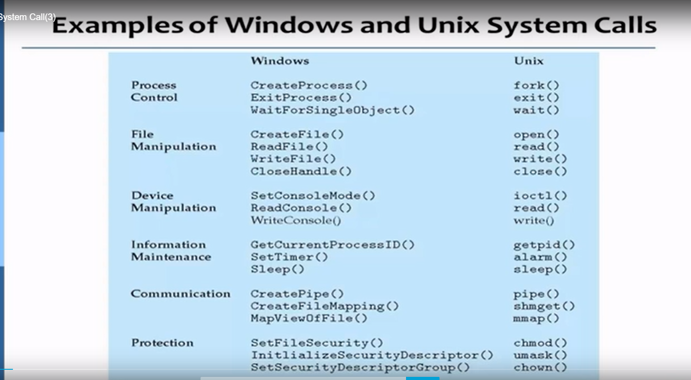
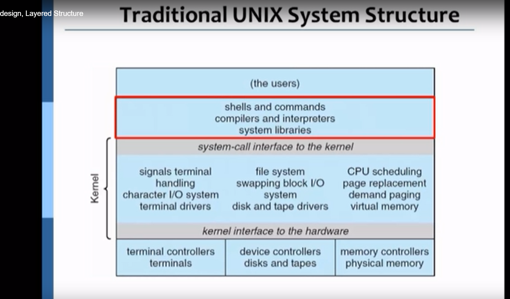
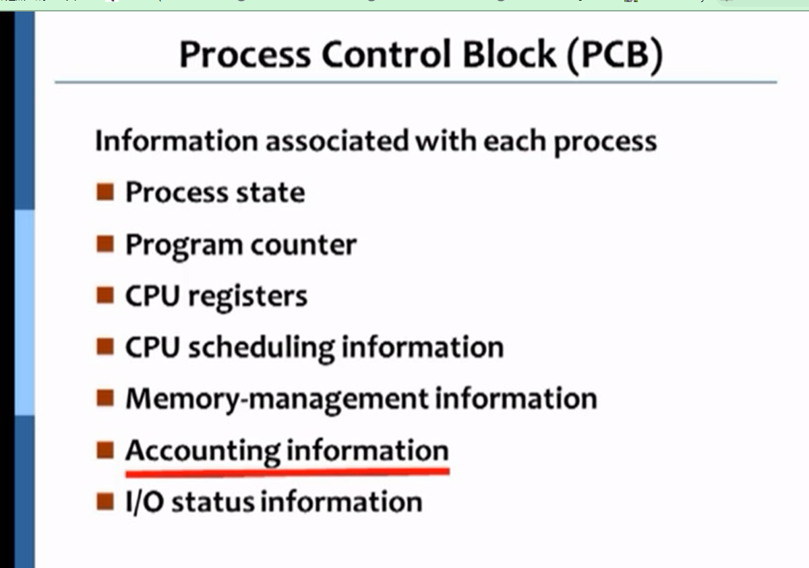
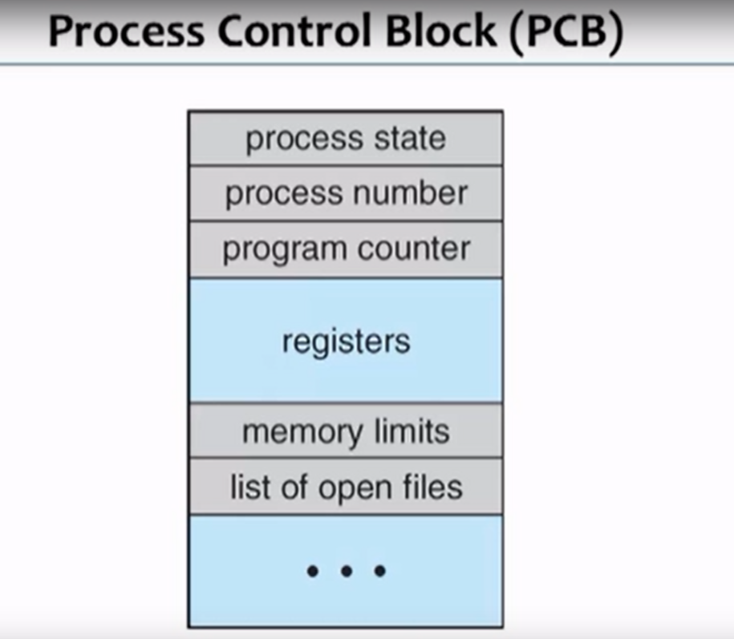
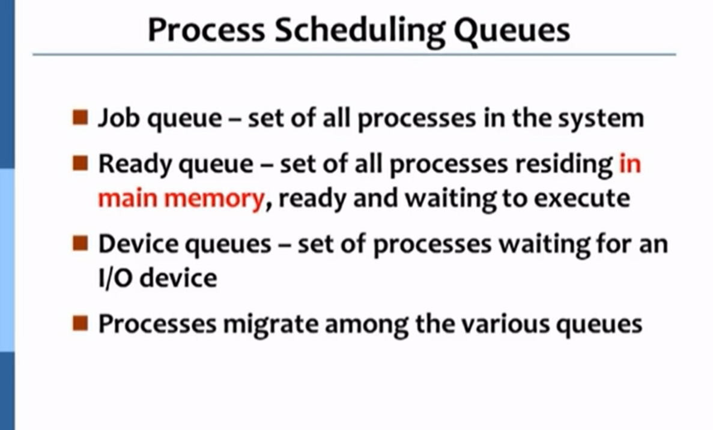
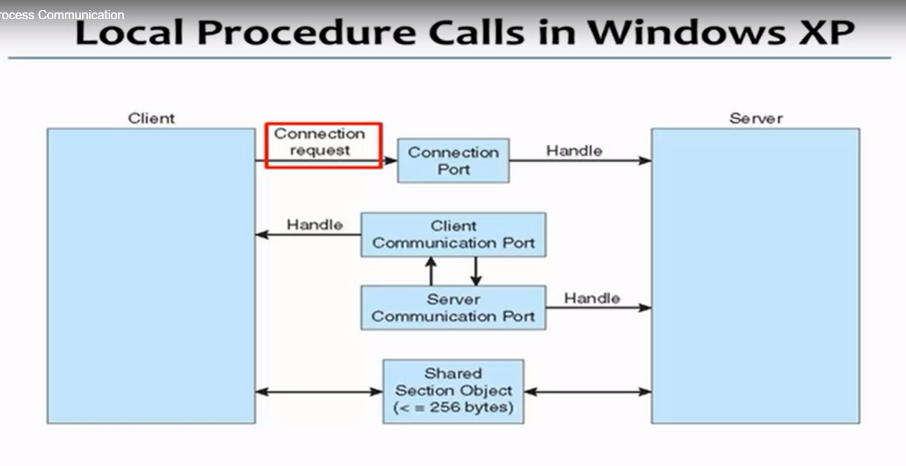
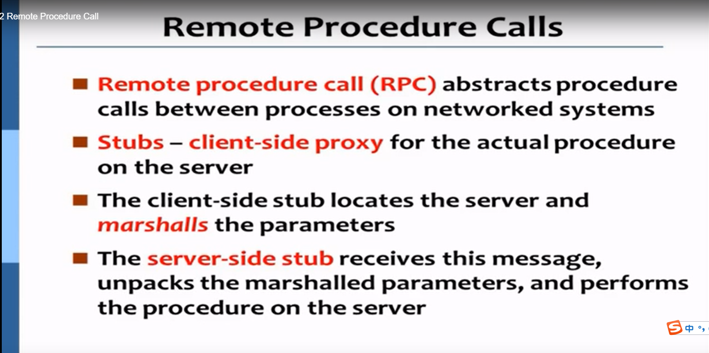
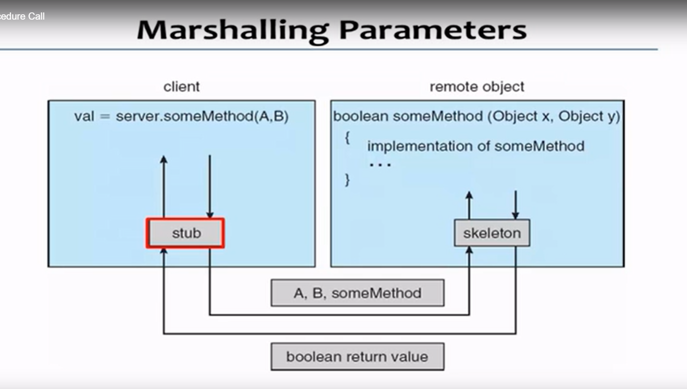
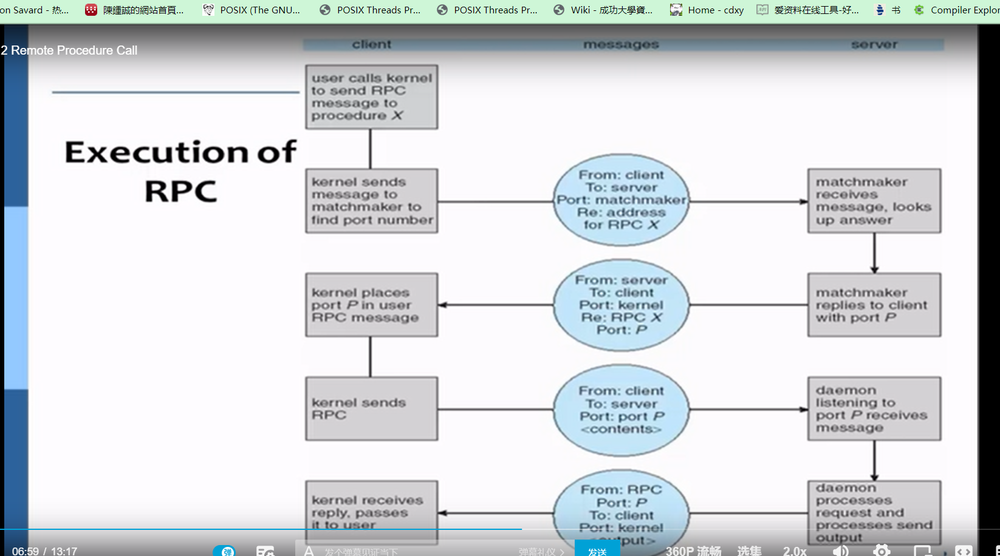
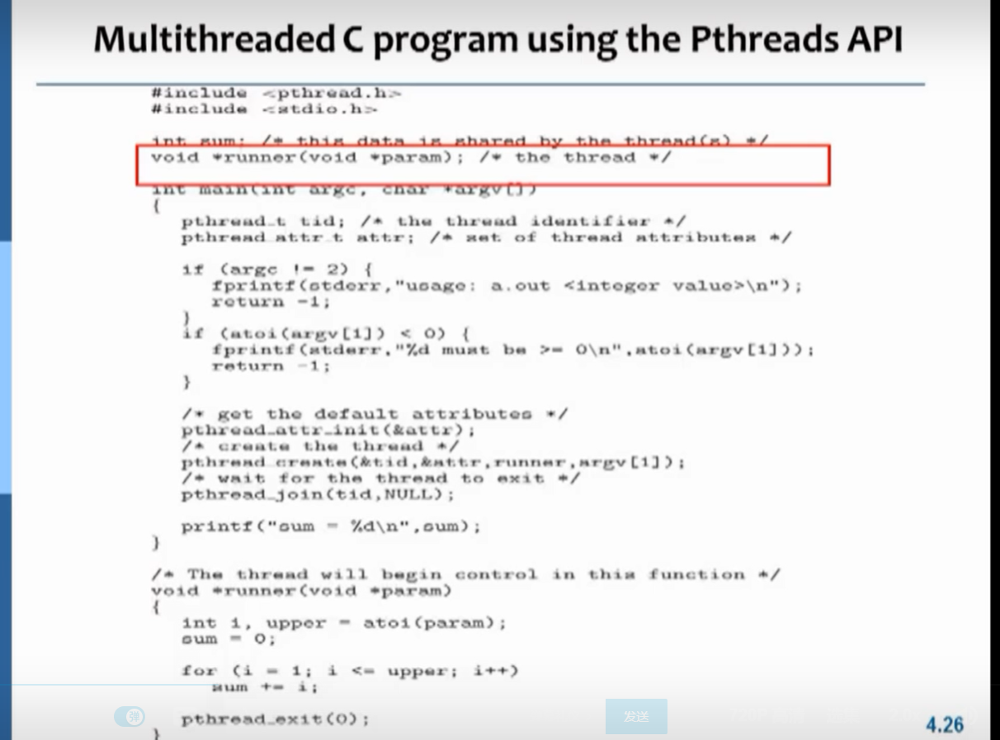

## 
##
## {:height 526, :width 758}
##     自己定义1024~65536     
## **the kernel is a computer program that manages I/O  requests from software,
 and translates them into data processing instructions for the central processing unit  and other electronic components of a computer. -- from wikipedia**
 **/proc 
 window of communication between the kernel and user space 
 dynamically generated files provide info on running system
 **
## 程序、API、计算机硬件 
