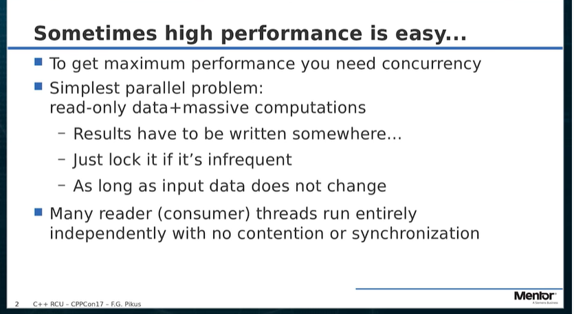
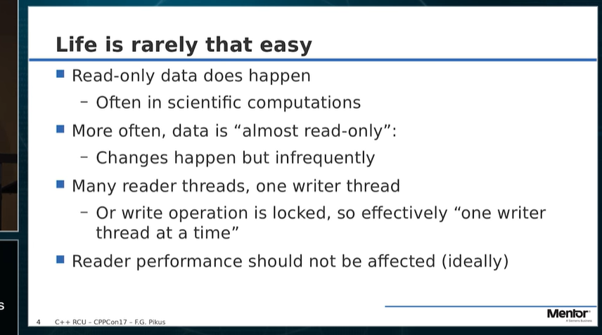
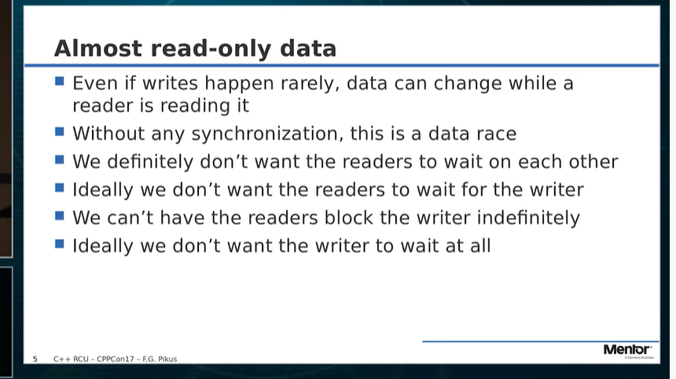
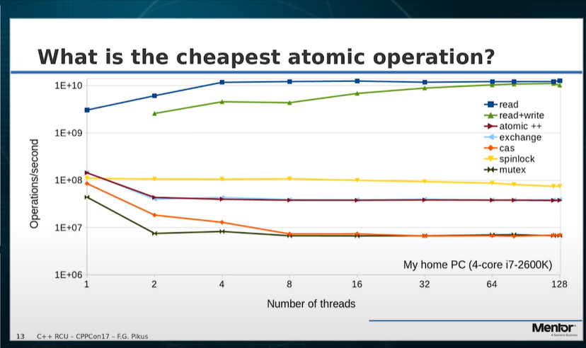
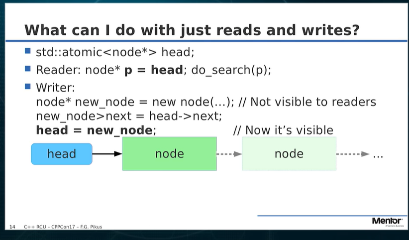

## updaters make copies maintain old and new data structures until old one no longer needed .
##
##
## RCU (Read, Copy, Update) is often the highest-performing way to implement concurrent data structures. The differences in performance between an RCU implementation and the next best alternative can be striking. And yet, RCU algorithms have received little attention outside of the world of kernel programming. Largely, this is because the most common drawback of RCU solution is complicated, and often wasteful, memory management. Kernel code has some advantages here, whereas a generic solution is much harder to design.

There are, however, cases when RCU is simple to use, offers very high performance, and the memory issues are easy to manage. In fact, you may already be using the RCU approach in your program without realizing it! Wouldn't that be cool? But careful now: you may be already using the RCU approach in your program in a subtly wrong way. I'm talking about the kind of way that makes your program pass every test you can throw at it and then crash in front of your most important customer (but only when they run their most critical job, not when you try to reproduce the problem).

In the more general case, we have to confront the problems of RCU memory management, but the reward of much higher performance can make it well worth the effort.

This talk will give you understanding of how RCU works, what makes it so efficient, and what are the conditions and restrictions for a valid application of an RCU algorithm. We focus on using RCU outside of kernel space, so we will have to deal with the problems of memory management... and yes, there will be garbage collection.    
