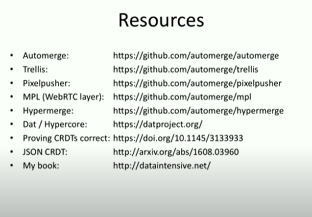
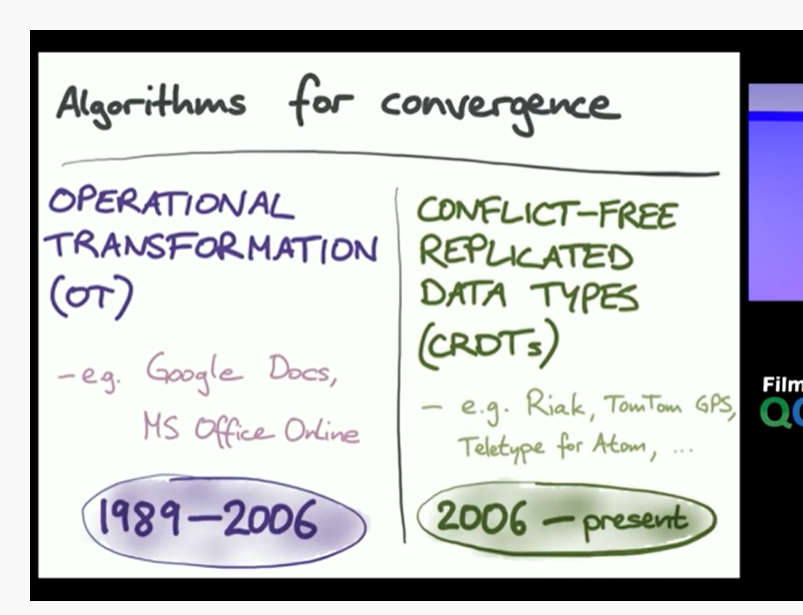
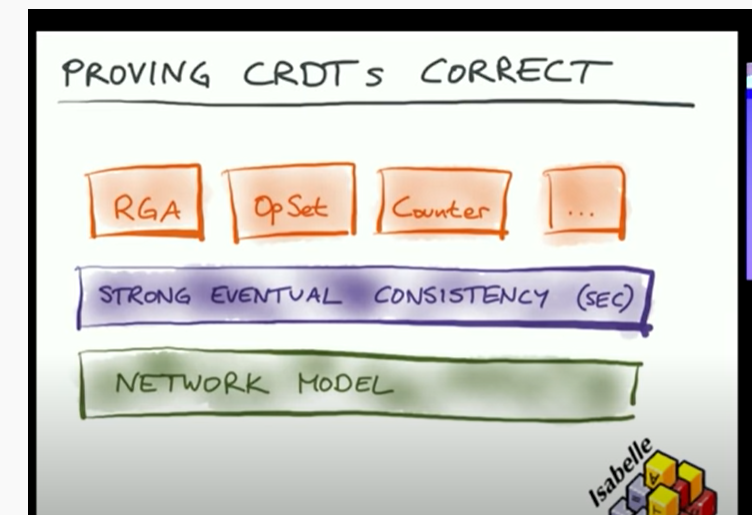
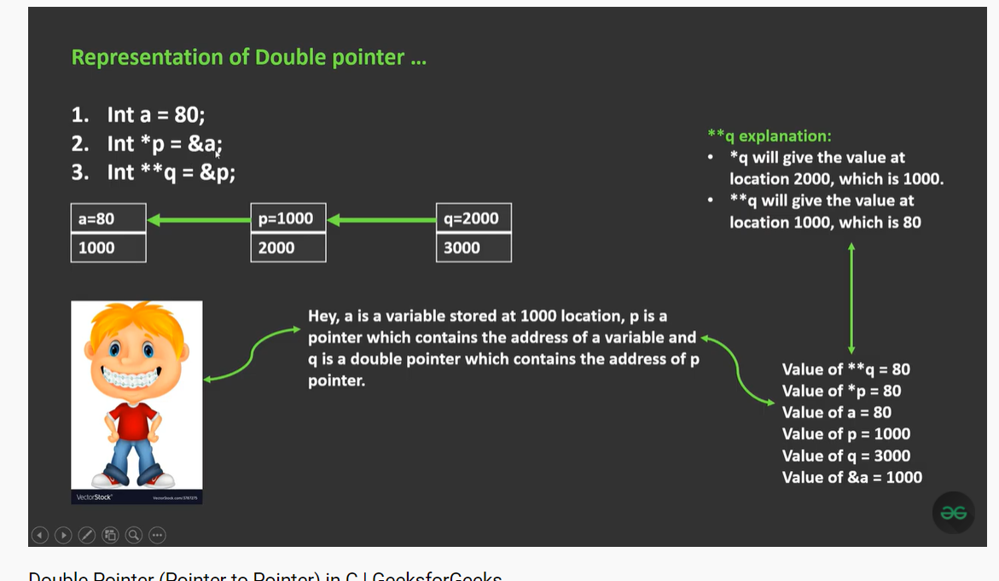

## 为什么需要fork?
## compiler中的IR(作用或者是目的)
## abs系统？？？？
## eBPF?????
## linux kernel hardening project???
## special purpose processors
## round robin???
## esxi???
## rcu?
## pe ??
##
##
## crdt?????   
## function pointer in c ????? or what is real purpose of pointer ? guess it's about addr update read write 
